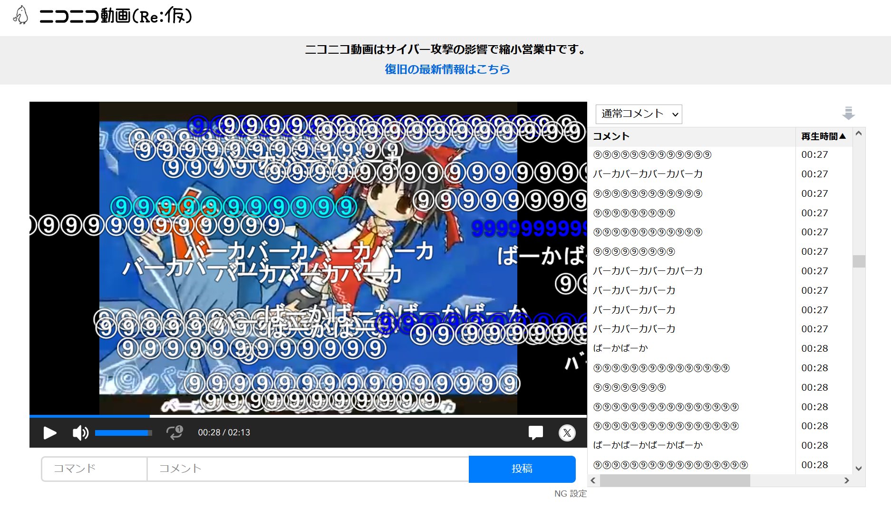

# nico-rekari-comment-panel-userscript

ニコニコ動画 (Re:仮) にコメント パネルを導入するユーザー スクリプト。  
動画プレイヤーの通信に割り込んでコメント一覧を取得する仕組みなので、余計な通信が発生せず縮小営業中のサーバーに優しいです。  
注: 事前に Tampermonkey などのユーザー スクリプト用拡張機能の導入が必要です。
  
[ここをクリックしてユーザー スクリプトをインストール](https://github.com/inonote/nico-rekari-comment-panel-userscript/raw/main/nico-rekari-comment-panel.user.js)

## 動作環境
* Desktop 版の Chrome, Firefox 最新版
* Greasemonkey, Tampermonkey 最新版

## ライセンス
MIT License
